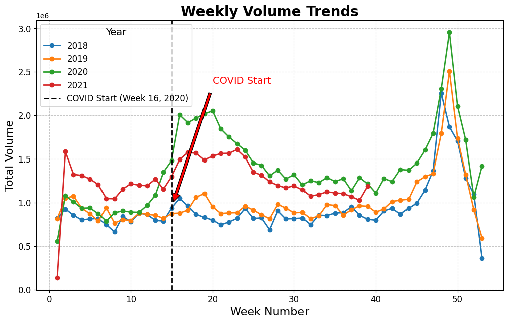
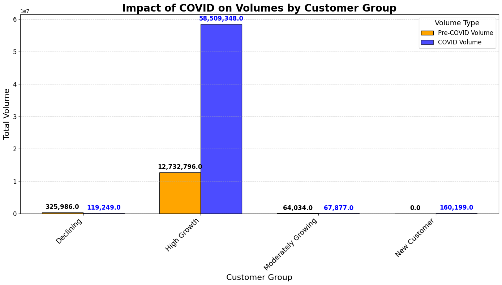
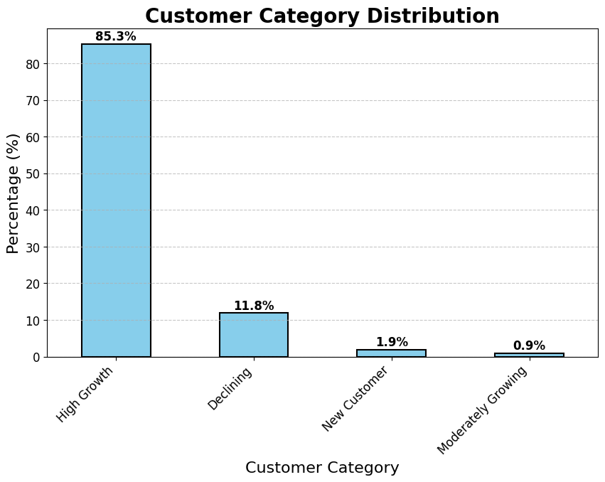
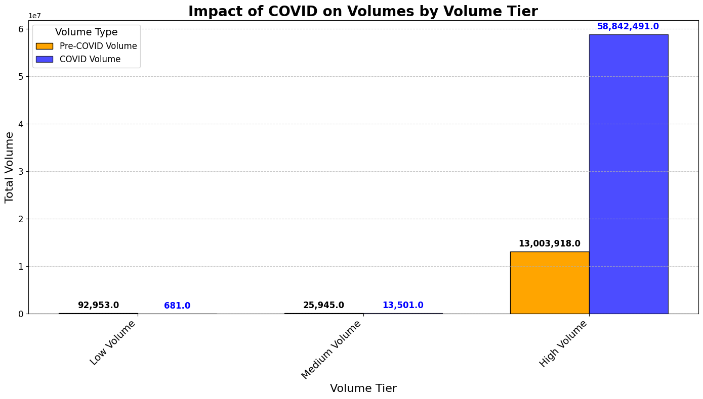
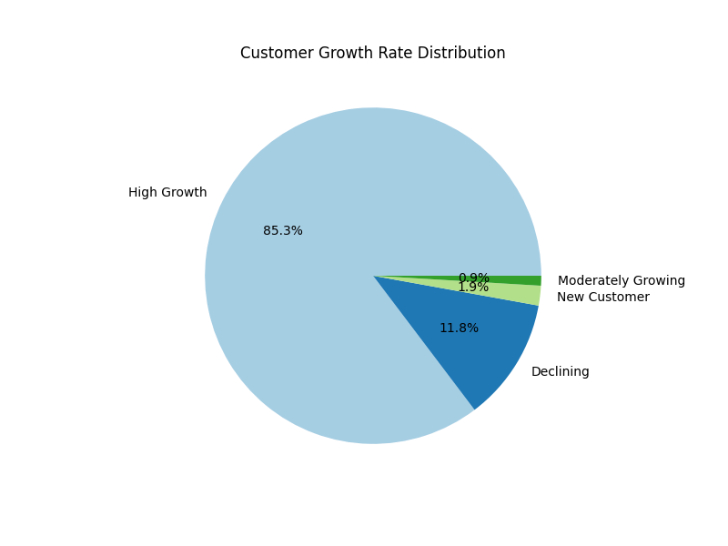
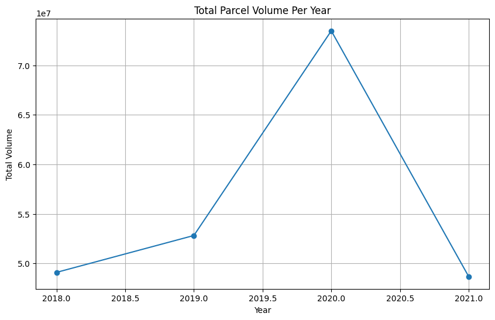
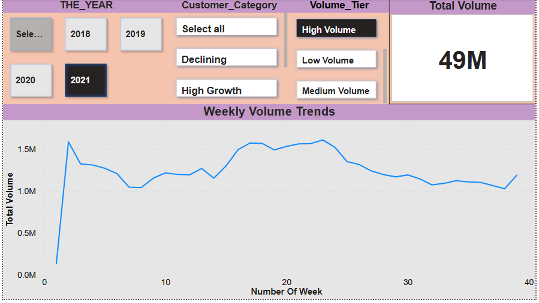

# 📦 COVID-19 Parcel Delivery Impact Analysis

This data science project explores how COVID-19 impacted parcel volumes, customer behavior, and delivery business trends. It includes in-depth analysis through Python notebooks, Power BI dashboards, and presentation materials based on real-world parcel and customer datasets.

---

## 📌 Project Overview

- **Project Title**: COVID-19 Parcel Volume and Business Impact
- **Author**: Ashish Pandya
- **Tools Used**: Python, Power BI, Jupyter Notebook, Pandas, Matplotlib, PowerPoint
- **Dataset Size**: 4 CSV files (~10K+ records total)
- **Goal**: Evaluate customer trends, parcel volume tiers, size-based preferences, and COVID disruptions in logistics.

---

## ❓ Business Questions Solved

- 📦 How did parcel delivery volumes change **before, during, and after COVID-19**?
- 🧍 Which **customer categories** contributed the most to volume trends?
- 📆 What were the **peak delivery weeks** during the pandemic?
- 🧮 Which **volume tiers** (small, medium, large) were most affected by delays or surges?
- 🔁 How did **customer growth rate** shift across regions and sizes?
- 📊 Which parcel sizes (M, L, XL) performed best during lockdown vs recovery periods?
- 📍 Were there any visible changes in **customer segment behavior** over time?
- 💼 How can the company **optimize delivery and inventory planning** based on trends?

---

## 📁 Folder Structure

```
.
├── Dataset
│   ├── COVID_Parcel_Business.csv
│   ├── Customer_Data_Analysis.csv
│   ├── Customer_Size_Discounts.csv
│   └── Volume_Tier_Impact.csv
│
├── Graph_Photos
│   ├── COVID_Impact_Volumes.png
│   ├── Customer_Category_Distribution(1).png
│   ├── Customer_Size_Volume.png
│   ├── Growth_Rate_Distribution_Pie.png
│   ├── Total_Parcel_Volume_Per_Year.png
│   ├── Volume_Tier_Distribution_Pie.png
│   ├── Volume_Tier_Impact.png
│   ├── Weekly_Parcel_Volumes_Before_and_During_COVID-19.png
│   └── Weekly_Volume_Trends.png
│
├── Notebooks
│   └── Final_Project_Python_Ashish.ipynb
│
├── Presentation
│   └── Final_Project_PPT_Ashish.pptx
│
├── powerbi
│   ├── DashBoard.PNG
│   ├── Python_Final_Project_Ashish.pbix
│   └── Total number of volumns.PNG
```

---

## 📊 Visual Insights

<table>
  <tr>
    <td></td>
    <td></td>
  </tr>
  <tr>
    <td align="center">📈 Weekly Volume Trends</td>
    <td align="center">📉 COVID Impact on Volumes</td>
  </tr>
</table>

<table>
  <tr>
    <td></td>
    <td></td>
  </tr>
  <tr>
    <td align="center">👥 Customer Category Distribution</td>
    <td align="center">📦 Volume Tier Impact</td>
  </tr>
</table>

<table>
  <tr>
    <td></td>
    <td></td>
  </tr>
  <tr>
    <td align="center">📊 Growth Rate by Customer Size</td>
    <td align="center">📆 Parcel Volume Over the Years</td>
  </tr>
</table>

---


## 🎯 Objectives

- Compare weekly parcel trends **before and during COVID-19**.
- Analyze **customer category volume distribution**.
- Study **parcel volume by size and tier**.
- Derive insights using **Power BI dashboards** and Python charts.
- Provide a **presentation-ready summary** of results.

---

## 🔬 Technical Details

### Python Notebook Features:
- Pandas for data preprocessing
- Matplotlib and Seaborn for plotting
- Pie/Bar/Line visualizations for trends and breakdowns

### Power BI Dashboard Includes:
- Volume trends by year and tier
- Customer type contribution
- COVID vs non-COVID period comparisons
- Category filters and slicers

---

## 📊 Power BI Dashboard Screens

<table>
  <tr>
    <td></td>
    <td></td>
  </tr>
  <tr>
    <td align="center">📊 Power BI Main Dashboard</td>
    <td align="center">🔢 Total Number of Volumes Summary</td>
  </tr>
</table>

---

## 📽️ Presentation

Included in the `Presentation/` folder:  
📂 **Final_Project_PPT_Ashish.pptx** – Summarizes the entire analysis with visuals and key insights.

---

## 📥 Dataset Sources

All datasets are stored inside the `Dataset/` folder:
- Customer parcel data
- COVID-19 delivery data
- Size and discount-based segmentations

---

## 📌 How to Run

1. Clone the repository:
   ```bash
   git clone https://github.com/AshishPandya-AI/COVID-Parcel-Delivery-Analysis.git
   cd COVID-Parcel-Delivery-Analysis
   ```

2. Run the Jupyter Notebook:
   ```bash
   jupyter notebook Notebooks/Final_Project_Python_Ashish.ipynb
   ```

3. Open `powerbi/Python_Final_Project_Ashish.pbix` in Power BI to explore dashboards.

---

## 📈 Key Insights

- COVID-19 led to **fluctuating parcel volumes**, especially in the initial months.
- **Customer category behavior shifted**, with corporate demand dropping while residential demand increased.
- **M & L sized parcels** were most popular post-COVID.
- **Volume Tier 2 and 3** faced supply chain delays more often.
- The presentation gives an executive summary with visuals and insights.

---

## 👨‍💻 Author

**Ashish Pandya**  
📧 Email: [YourEmail@example.com]  
🔗 GitHub: [github.com/AshishPandya-AI](https://github.com/AshishPandya-AI)

---

## 📃 License

This project is open-source and free to use for academic and professional purposes. MIT License.
